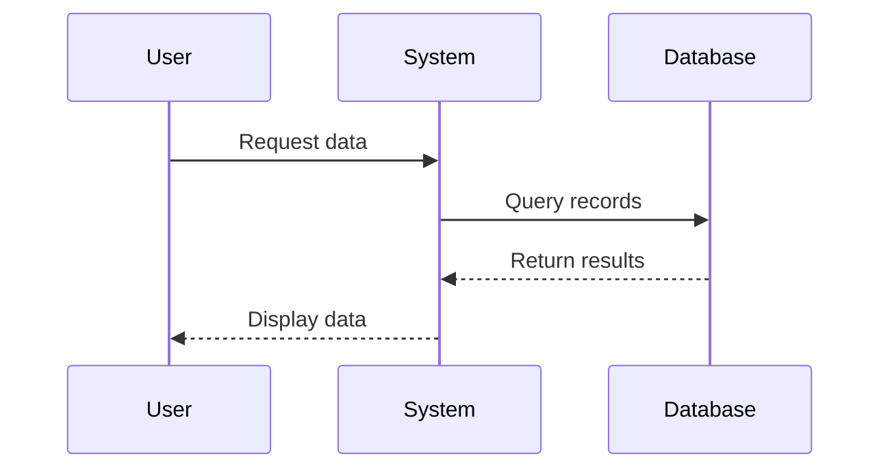

# KMS-360° - SD7 Knowledge Management System

## System Overview

KMS-360° is a comprehensive Knowledge Management System designed for SD7 Indomaret IT to capture, index, visualize, and retrieve all technical knowledge including legacy code documentation, SQL queries, error logs, SOPs, and process flows.

## Features

### 1. Dashboard
- Overview of all knowledge assets with statistics
- Quick navigation to all modules
- Real-time counters for each knowledge category

### 2. Upload Center
Automated file processing for three types of content:

**VB/VB.NET Code Files (.vb, .bas, .cls)**
- Extracts all Sub and Function declarations
- Identifies SQL queries embedded in code
- Auto-generates summary of code structure
- Stores functions and queries for future reference

**SQL Files (.sql)**
- Parses and categorizes SQL statements
- Extracts SELECT, INSERT, UPDATE, DELETE operations
- Adds queries to searchable library
- Links queries to source files

**Log Files (.log, .txt)**
- Detects error patterns automatically
- Classifies errors into categories:
  - price_mismatch
  - bkp_missing
  - plu_not_found
  - ppn_error
  - gudang_mismatch
  - general_error
- Identifies root causes for each error type
- Auto-generates sequence flow diagrams from logs

### 3. Knowledge Browser
Four-tab interface for exploring all knowledge:

**Code Docs Tab**
- View all uploaded code files
- See extracted functions and SQL queries
- Browse code summaries and metadata

**SQL Queries Tab**
- Searchable query library
- Categorized by query type (SELECT, INSERT, UPDATE, etc.)
- View source file references
- Code syntax highlighting

**Error Intelligence Tab**
- Browse all error logs
- Filter by error category
- View error patterns and root causes
- Track error frequencies

**SOP Library Tab**
- Standard Operating Procedures
- Step-by-step resolution guides
- Links to related error categories

### 4. AI Search Center
Semantic search across all knowledge:
- Natural language queries
- Example: "Mengapa price_idm toko 0344 berubah?"
- Searches across:
  - Code documentation
  - SQL queries
  - Error logs and patterns
  - SOP procedures
- Results grouped by category
- Relevance scoring for each result

### 5. Flow Visualizer
Interactive sequence diagram viewer:
- Auto-generated flows from log uploads
- Manual flow creation using Mermaid syntax
- Visual representation of system interactions
- Export capability for documentation

## Technical Architecture

### Database Schema (Supabase)

**code_docs**
- Stores VB/VB.NET code files
- Extracts functions and queries as JSONB
- Full-text searchable

**error_logs**
- Stores log files with error analysis
- JSONB array of detected errors
- Categorized and classified automatically

**query_library**
- Centralized SQL query repository
- Categorized by operation type
- Source file tracking

**sop_library**
- Standard operating procedures
- Step-by-step instructions
- Related error mappings

**flows**
- Mermaid-based sequence diagrams
- Auto-generated from logs or manual creation
- Visual process documentation

### Parser Logic

**VB Code Parser**
- Regex-based function/sub detection
- SQL statement extraction from string literals
- Line number tracking for reference

**SQL Parser**
- Query type identification
- Multi-line query support
- Semicolon-based statement separation

**Log Parser**
- Pattern matching for common errors
- Error classification engine
- Root cause mapping

**Flow Generator**
- Trace analysis from logs
- Automatic Mermaid diagram generation
- Participant identification

## Usage Examples

### Uploading Code
1. Navigate to Upload Center
2. Select "VB/VB.NET Code" type
3. Choose your .vb file
4. System automatically extracts:
   - All functions and subs
   - Embedded SQL queries
   - Generates summary
5. Queries are added to Query Library

### Searching Knowledge
1. Go to Search Center
2. Type natural language query:
   - "price mismatch toko 0344"
   - "SELECT statement untuk BKP"
   - "error handling untuk PLU"
3. Review results grouped by type
4. Click any result for details

### Creating Flow Diagrams
1. Navigate to Flow Viewer
2. Click "Create Flow"
3. Enter title
4. Write Mermaid code:

5. Diagram renders automatically

### Browsing Errors
1. Open Knowledge Browser
2. Select "Error Intelligence" tab
3. Click any error log
4. View:
   - Error patterns detected
   - Categories (price_mismatch, ppn_error, etc.)
   - Root cause analysis
   - Line numbers for reference

## Error Categories Reference

| Category | Description | Common Causes |
|----------|-------------|---------------|
| price_mismatch | Price differences between systems | Sync failure, manual override |
| bkp_missing | BKP record not found | Missing master data, deletion |
| plu_not_found | PLU code missing | Sync issue, new product |
| ppn_error | Tax calculation error | Config issue, missing rate |
| gudang_mismatch | Warehouse data inconsistency | Multi-location sync problem |
| general_error | Uncategorized system error | Various causes |

## API Integration

All data operations use Supabase client:

```typescript
import { supabase } from './lib/supabase';

// Query example
const { data } = await supabase
  .from('code_docs')
  .select('*')
  .order('created_at', { ascending: false });

// Insert example
await supabase.from('query_library').insert({
  query_text: 'SELECT * FROM tbl_price',
  category: 'select',
  source_file: 'PriceModule.vb'
});
```

## Future Enhancements

1. Real AI/LLM integration for semantic search
2. Code similarity detection
3. Automated SOP generation from error patterns
4. Integration with version control systems
5. Real-time log monitoring and alerting
6. Export to PDF/Word documentation
7. Team collaboration features
8. Analytics dashboard for error trends

## System Requirements

- Modern web browser (Chrome, Firefox, Edge)
- Internet connection for Supabase
- Node.js 18+ for development

## Support

For issues or questions, contact SD7 Indomaret IT support team.
